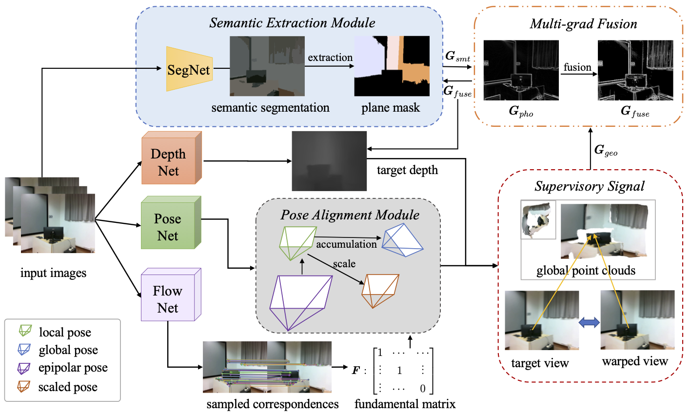

# SEOVO: Online Indoor Visual Odometry with Semantic Assistance under Implicit Epipolar Constraint
> **Indoor challenges for VO**: The performance of existing indoor deep VO schemes is still limited in comparison with their outdoor counterparts mainly owning to the following two reasons: 1) large areas of textureless regions can be more frequently seen indoors such as walls, blackboards, etc, which contain extremely sparse photometric features; 2) the complex indoor motions cause more difficulty to the pose regression network than the outdoor motions which  are dominated by simple translation components. 

> **Our solutions**:  

* In this paper, the above two challenges are carefully tackled with the proposed SEOVO (Semantic Epipolar-constrained Online VO), introducing both the semantic and the geometric cues in an online manner to improve the performance of the depth and the pose estimation.
* SEOVO is the first semantic-aided VO under an online adaptive framework, which adaptively handles the low-texture planes without any supervision, guaranteeing the reconstruction results in these challenging areas with  better generalization ability.
* We introduce the epipolar geometric constraint in an implicit way for improving the accuracy of the pose estimation without destroying the global scale consistency.

> More details including the collected textureless dataset and the demo video can be found on the [project website](https://cslinzhang.github.io/SEOVO/SEOVO.html).

## Pipeline of SEOVO
  

## Software Environment
* pytorch 1.8.1
* opencv-python 4.5.3
* scikit-image 0.17.2
* imageio 2.15.0 
* scipy 1.5.4
* matplotlib 3.3.4

## Hardware Environment
Our model is run on **Nvidia GeForce RTX 3070**.

## Data Pre-processing
The testing folder are supposed to be organized as:
> testing folder/
>> color/  --the testing rgb sequence

>> intrinsics.txt -- the camera intrinsics(a 3*4 matrix)

>> (optional) depth/ -- the depth GTs (only for validation if you want)

## Training
```python3 test_vo_flow_trian_organize.py --pretrained-flow flow_net_checkpoint.pth.tar --pretrained-pose exp_pose_model_best.pth.tar --pretrained-disp dispnet_model_best.pth.tar --input-folder testing folder --output-folder  (--with-gt)```

--pretrained-flow: the initialized weights of flownet pretrained on NYUv2

--pretrained-depth: the initialized weights of depthnet pretrained on NYUv2

--pretrained-disp: the initialized weights of posenet pretrained on NYUv2

--with-gt: the predicted depth maps will be evaluated compared with the gt depths which must be given in the data preprocessing. The output evaluation metrics are **abs_diff, abs_rel, sq_rel, $\sigma_1$, $\sigma_2$, $\sigma_3$** 

--input-folder: the input directory organized as described in the data preprocessing

--output-folder: the output directory which is composed of :
* a "keyframe" folder containing selected keyframes from the input sequences
* a "depth" folder containing out depth maps of the keframes
* a "poses.txt" file containing **global** poses for each keyframe

## Reconstruction
Since we have obtained the poses and the depths, we can synthesize the corresponding point cloud using the codes provided in the ch12 of [slambook](https://github.com/gaoxiang12/slambook2) which are based on **++**.

## Software Environment (the installation tutorials are also provide in the slambook)
* Opencv
* Eigen
* PCL

## Build & Run
``` mkdir build
cd build
cmake ..
make
./pointcloud_mapping
pcl_viewer map.pcd
```
